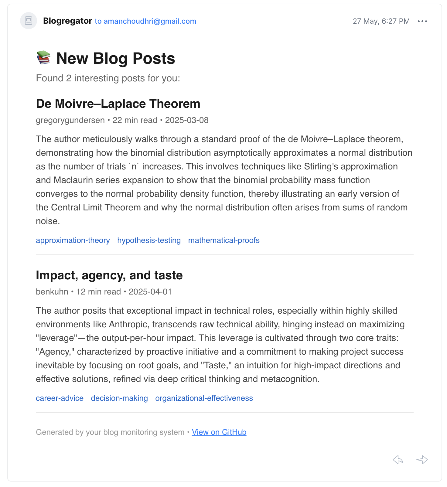

# blogregator

There are so many great blogs out there,
but it's hard to stay up to date—especially because many don't have RSS feeds. So I built Blogregator to help me keep track of
the latest posts from blogs I follow.

Blogregator is a tool for automatically scraping blogs, extracting metadata
from posts, and updating you when a new post drops.

## How It Works

Blogregator uses a combination of web scraping and large language models to monitor a list of blogs for new posts. Here's a breakdown of the process:

1.  **Add a Blog**: You can add a blog to the monitoring list via a command-line interface (CLI). The tool will fetch the blog's content and use an LLM to generate a suitable scraping schema.
2.  **Automated Checks**: A long-running server checks for new blog posts every 6 hours (configurable).
3.  **Scraping and Parsing**: For each blog, the system scrapes the main page and parses it to find new posts that aren't already in the database.
4.  **Content Extraction**: For each new post, it extracts the full text content and uses an LLM to generate a summary, estimate the reading time, and categorize it with relevant topics.
5.  **Daily Newsletter**: Each day at midnight UTC, a digest newsletter is sent with new posts from the past 24 hours.
